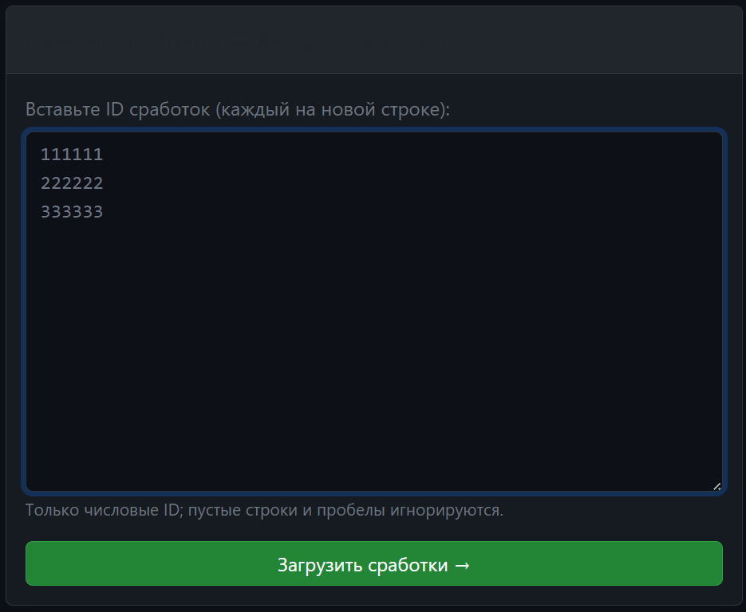
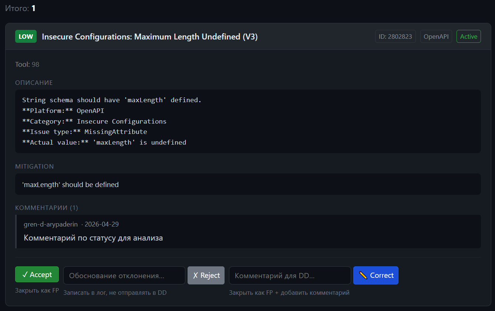

### Установка и запуск

##### При локальном запуске не через контейнер изменить 
```
pip install -r requirements.txt

# установить переменные окружения с данными ДД
$env:DD_URL="https://defectdojo.your-company.com"
$env:DD_API_KEY="your_token"
export DD_URL="https://defectdojo.your-company.com"
export DD_API_KEY="your_token"

# запуск приложения
# изменить в app.py в app.run (host="0.0.0.0"...) значение на host="127.0.0.1"
python app.py
```

##### При локальном запуске через docker
```
создать .env файл на основе .env.example
docker-compose up -d --build
```

### Как работать с приложением

##### Шаг 1. Загрузить finding по id из DD



##### Шаг 2. Провести анализ и принять решение по статусу



### Структура проекта

```
dd_triage/
├── app.py              # Flask-приложение, маршруты
├── config.py           # Настройки из переменных окружения
├── dd_client.py        # Клиент DefectDojo API
├── requirements.txt
├── .env.example        # Шаблон переменных окружения
├── logs/               # Лог-файл triаge.log
└── templates/
    ├── index.html      # Экран ввода ID
    └── findings.html   # Экран разбора сработок
```

Регулярка для усечение лога ^\d{4}-\d{2}-\d{2}\s+\d{2}:\d{2}:\d{2},\d{3}\s+\[[^\]]+\]\s+
